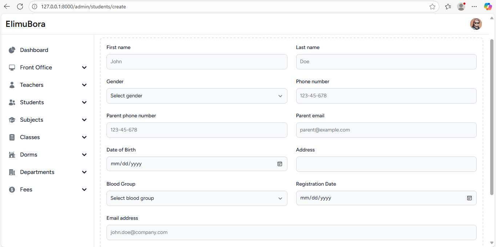
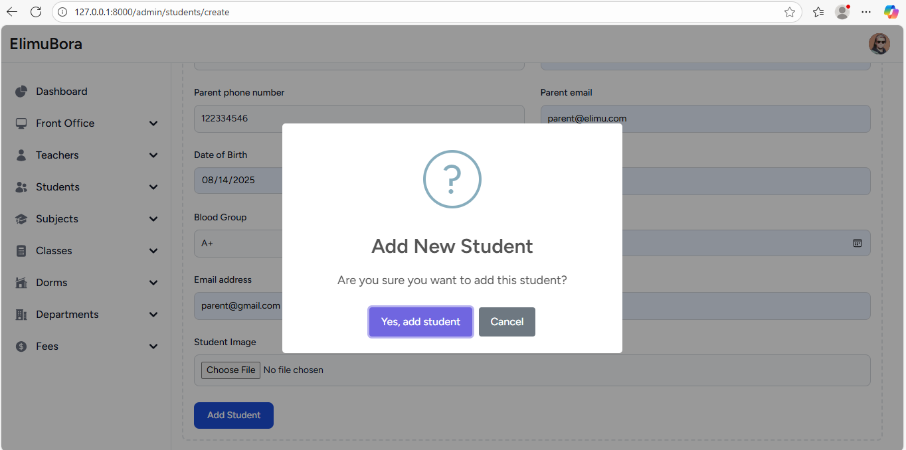
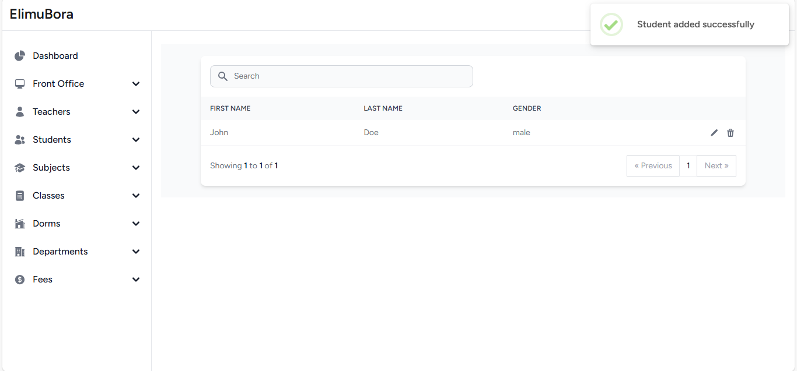
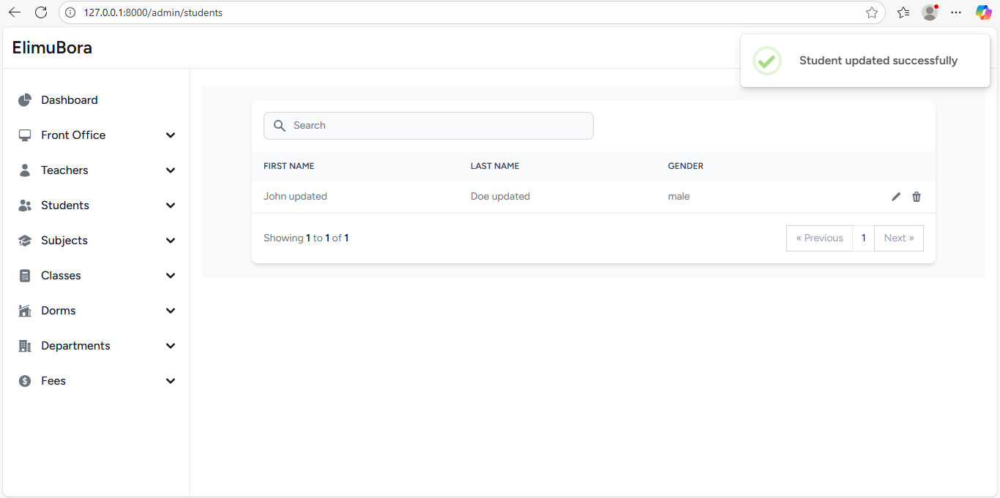
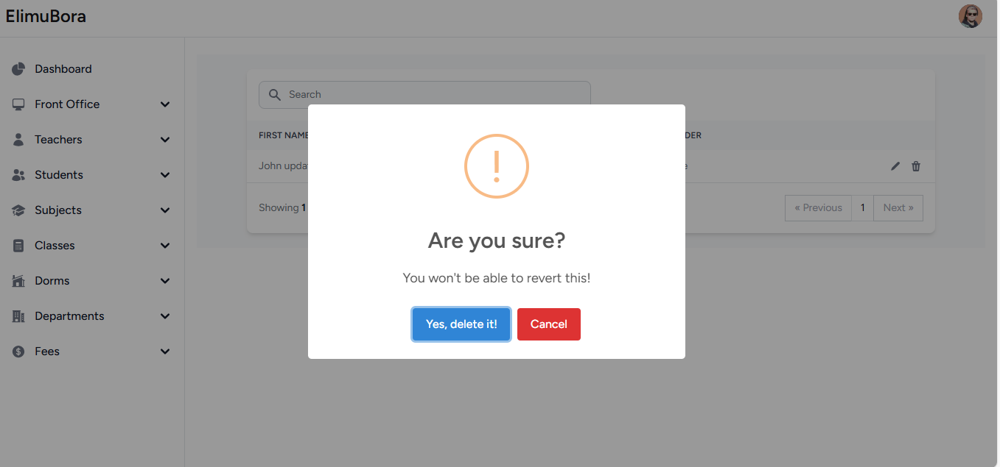

<h1>School Management System</h1>

The images below show a simple demo of the application

<h4>Adding a new student</h4>
 

<h4>Confirm to add a new student</h4>

<h4>Added the new student</h4>

<h4>Updating the student</h4>

<h4>Updated student</h4>

<h4>Deleting student</h4>

